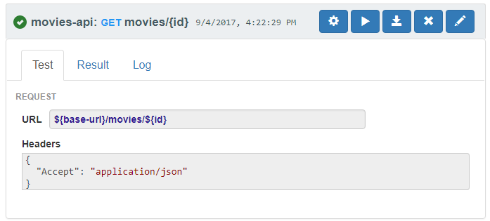
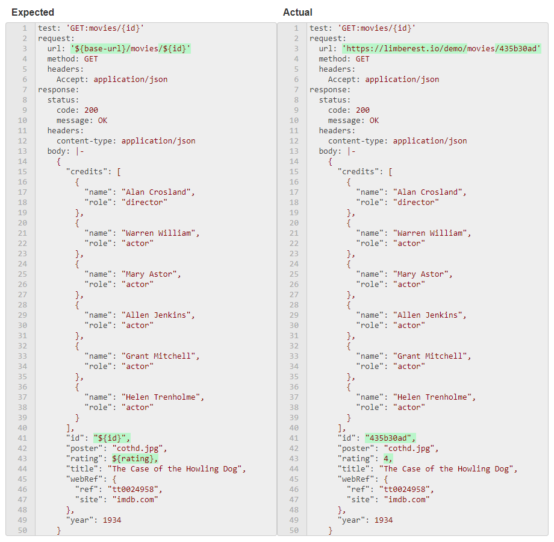
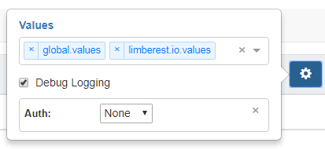

## Testing
Automated API testing is the most popular feature of Limberest. When execution a test, 
you'll invoke actual REST calls to exercise *any* API (not just those built on Limberest).
Every aspect of a test can be parameterized using [Values](#values).

### [Tests](https://limberest.io/ui/testing)
Individual tests are grouped in JSON artifacts that include parameterized request information.
Limberest has its own native JSON format, but the easiest way to get started is to
[create and export a collection](https://www.getpostman.com/docs/postman/collections/creating_collections) 
in [Postman](https://www.getpostman.com/).  For example, the [limberest-demo](https://github.com/limberest/limberest-demo)
project has an exported [movies-api collection](https://github.com/limberest/limberest-demo/blob/master/test/movies-api.postman).

Every request in the collection can be run individually, or linked together in Limberest [Cases](#cases).
An intuitive way to visualize a request is through in the Limberest UI.  Here's what the 
['GET movies/{id}'](https://limberest.io/ui/testing/movies-api/GET/movies/{id}) request looks like:



(See ['POST movies'](https://limberest.io/ui/testing/movies-api/POST/movies) for an example of a request that includes a body.) 

When you run a test in Limberest, it generates results in [YAML](http://yaml.org/) format.  After execution, here's 
what the Result tab looks like for 'GET movies/{id}':



The green highlights indicate successful matching of runtime [Values](#values).  Mismatches would cause the test to fail
and be highlighted in red.  For comparison purposes, YAML comments are ignored.

YAML gives a nicely readable rendition of the expected vs. actual result.  Notice that the result includes not only 
the response body, but also its status and headers.  If the request had a body, that would be represented as well.

The [expected result YAML](https://github.com/limberest/limberest-demo/blob/master/test/results/expected/movies-api/GET_movies_{id}.yaml) 
is retrieved from GitHub, where the results for all tests and cases are reposited.

### [Values](https://limberest.io/ui/values)
Values provide a way to repeatedly run tests with varying input.  Values files are JSON.  They can be in
[Postman environment](https://www.getpostman.com/docs/postman/environments_and_globals/manage_environments) format,
or as (simpler and preferred) straight-JSON objects.  Values can hold environment-specific parameters like these:
  - [limberest.io.values](https://github.com/limberest/limberest-demo/blob/master/test/limberest.io.values)
  - [localhost.values](https://github.com/limberest/limberest-demo/blob/master/test/localhost.values)

But values can also hold arbitrary testing data like this:
  - [global.values](https://github.com/limberest/limberest-demo/blob/master/test/global.values)
  
As illustrated above, values are referenced in result YAML using JavaScript 
[template literal expressions](https://developer.mozilla.org/en-US/docs/Web/JavaScript/Reference/Template_literals) syntax:
```
'${base-url}/movies/${id}'
``` 
In Limberest UI, values are applied by selecting their JSON source file like so:



(applied from left to right like in JavaScript's 
[Object.assign()](https://developer.mozilla.org/en-US/docs/Web/JavaScript/Reference/Global_Objects/Object/assign) function).
Values JSON does not have to be flat; it can contain nested objects referenced through expressions like `${order.customer.name.first}`. 

Feel free to apply values and try GET requests yourself in Limberest's [Demo UI](https://limberest.io/ui/testing).
Tests execute in your browser, and results are retained in [local storage](https://developer.mozilla.org/en-US/docs/Web/API/Window/localStorage),
so nothing is saved back to the server.  Unless you install and run [limberest-demo](https://github.com/limberest/limberest-demo/blob/master/README.md)
locally, you won't be able to submit POST, PUT or DELETE requests since those require authorization.

You can even edit the request content or expected result YAML by clicking the pencil icon .
All your changes are saved in browser local storage, so experiment freely with successful and unsuccessful results.

### [Cases](https://limberest.io/ui/cases)
Tests based on single requests can be fragile.  What if we were to run DELETE before POST?  We'd likely get an HTTP 404 response,
which would disagree with the expected result.  Real-world APIs need an orchestration approach, and that's what Limberest cases deliver.
Cases use JavaScript to string together multiple requests.  They can include conditionality and populate values programmatically, and they
can easily parse JSON response content.  This gives you the power to build tests as complex as the API you're evaluating.

Take a look at this snippet from the limberest-demo [movie-crud.js](https://github.com/limberest/limberest-demo/blob/master/test/cases/movie-crud.js)
test case:
```javascript
const limberest = require('limberest');
const demo = require('../lib/limberest-demo');
...
  demo.cleanupMovie(values, (err, response) => {
    if (err) {
      logger.error(err);
    }
    else {
      logger.info('Cleanup completed for: ' + values.id);
      
      limberest.loadGroup(options.location + '/movies-api.postman', (err, group) => {
        if (err) {
          logger.error(err);
        }
        else {
          // start a new case
          var testCase = new limberest.Case(caseName, options);
          testCase.authHeader = demo.getAuthHeader();

          // create a movie
          var post = group.getTest('POST', 'movies');
          testCase.run(post, values, (err, response) => {
            if (!err) {
              // update it (with programmatically-set rating)
              values.rating = 4.5;
              var put = group.getTest('PUT', 'movies/{id}');
              testCase.run(put, values, (err, response) => {
                if (!err) {
                  // confirm update
                  var get = group.getTest('GET', 'movies/{id}');
                  testCase.run(get, values, (err, response) => {
                    if (!err) {
                      // delete it
                      var del = group.getTest('DELETE', 'movies/{id}');
                      testCase.run(del, values, (err, response) => {
                        // confirm delete
                        testCase.run(get, values, (err, response) => {
                          // verify results
                          var res = testCase.verify(values, (err, result) => {
...
```
This illustrates a number of concepts:
  0. You can leverage helper functions and third-party [Node.js](https://nodejs.org/en/) modules through `require()` syntax.
     In fact, while building cases it's very convenient to run them from the command-line:
     ```
     node movie-crud
     ```
  0. You can perform preliminary cleanup.  The demo.cleanupMovie() function invokes a DELETE and doesn't care whether
     the response comes back with HTTP 200 or 404.  We start our case execution with a clean slate.
  0. You can employ asynchronicity, which is a natural paradigm for request/response processing.
     In this example, notice how we pass callback implementations using 
     [ES6 arrow function](https://developer.mozilla.org/en-US/docs/Web/JavaScript/Reference/Functions/Arrow_functions)
     syntax to postpone execution until the response from the previous operation is received.
  0. You can invoke requests repeatedly, as we've done with GET above to confirm both our UPDATE and our DELETE
     operation outcomes.
  0. You can programmatically override or supplement values, as we've done by assigning `values.rating = 4.5`.
     The updated values are substituted in the request and also passed to testCase.verify() so they'll be used
     when evaluating the expected vs. actual result YAML.  This gives you the flexibility to pull values from
     an API response and use them to populate subsequent requests.
     
When invoked from the command-line, Limberest stores results and logs on the file system and performs comparisons from there:
```
node movie-crud
...
...
Comparing: ../results/expected/movies-api/movie-crud.yaml
  with: ../results/actual/movies-api/movie-crud.yaml
Case "movie-crud" PASSED
Result: {
  "status": "Passed",
  "message": "Test succeeded"
}
```
If you clone the [limberest-demo](https://github.com/limberest/limberest-demo) project you can run the command 
above from the test/cases/ directory.

In fact, the [limberest-js](https://www.npmjs.com/package/limberest) node module has all kinds of capabilities for
complete API test automation, with or without the Limberest UI webapp.

Next Topic: [Access Control](auth)
